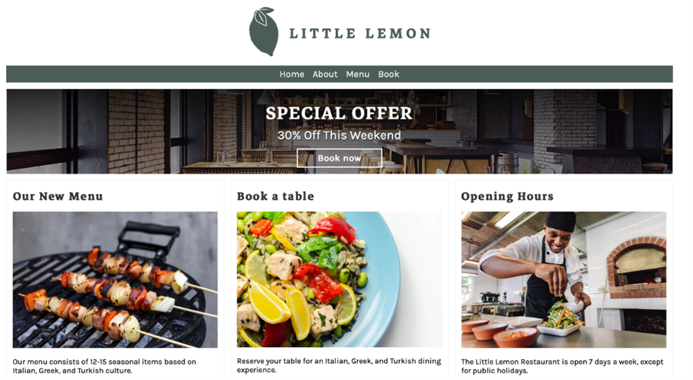
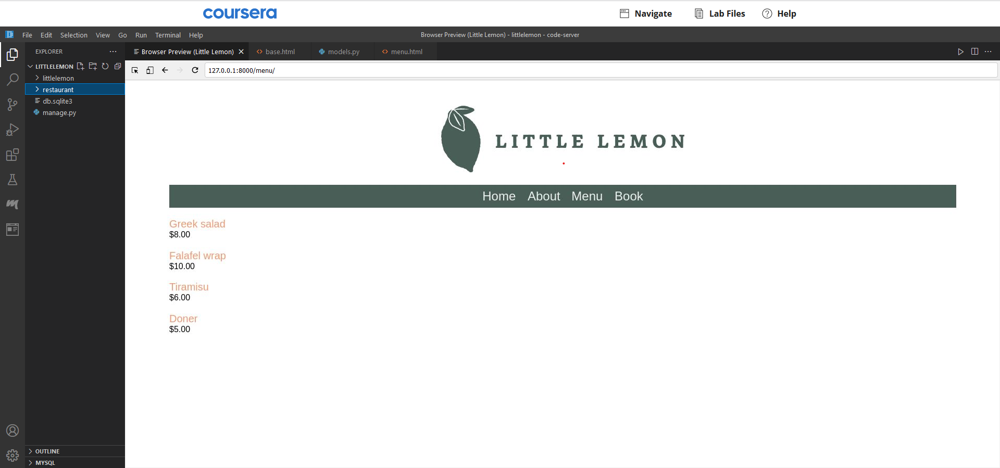
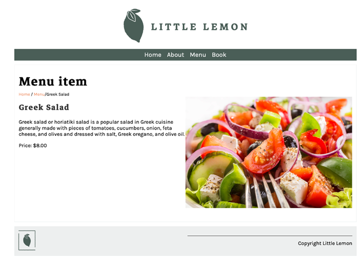

# **Simple Django application**

Django application build for META backend developer certificate.

Its a site fir Little Lemon restaurant with ability to view menu items and description as well as booking a table.

**To Run locally**

1. Make sure you are in little lemon directory
2. Run `python manage.py run server`

**Overview**

The Little Lemon website will consist of five pages:

- Home
- About
- Booking
- Menu
- Menu Item

**Screenshots**

